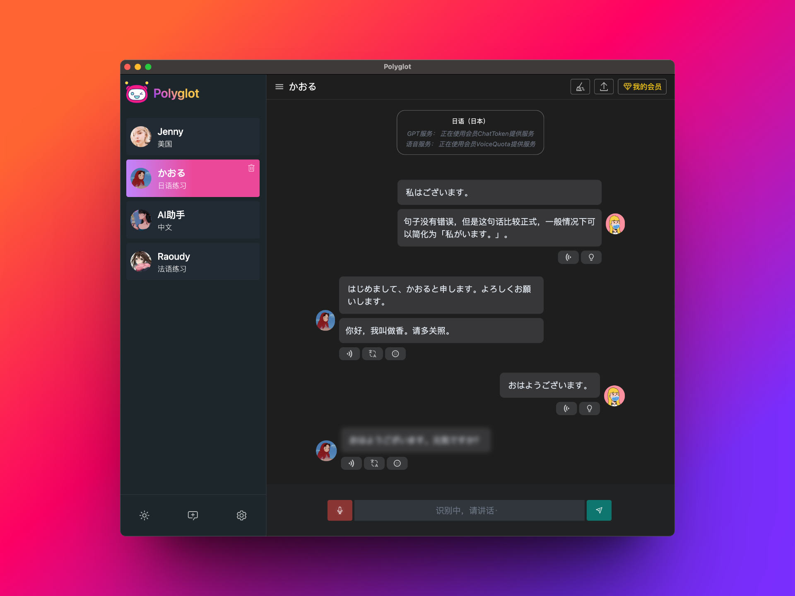
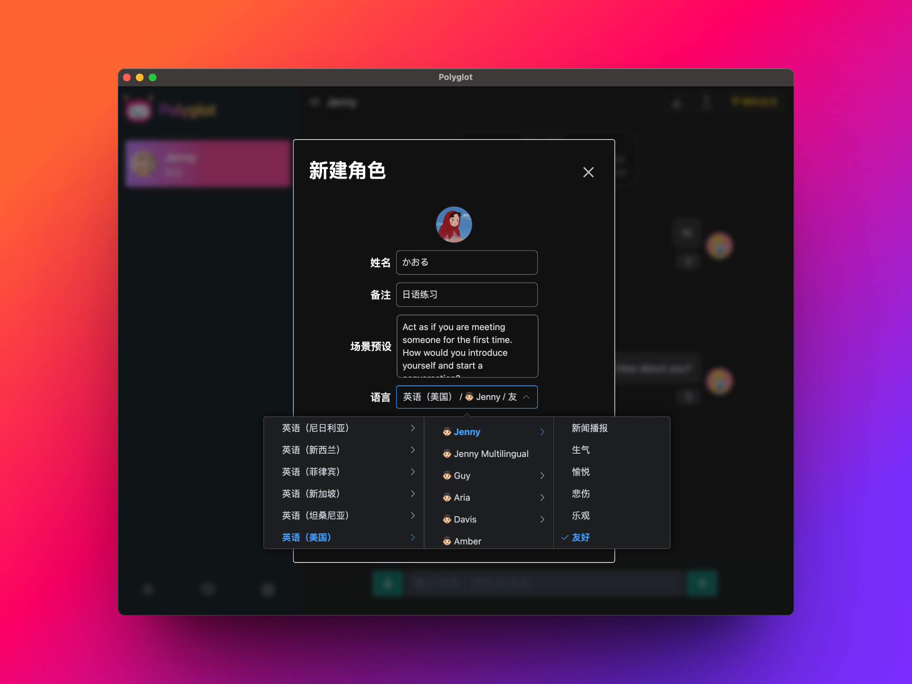
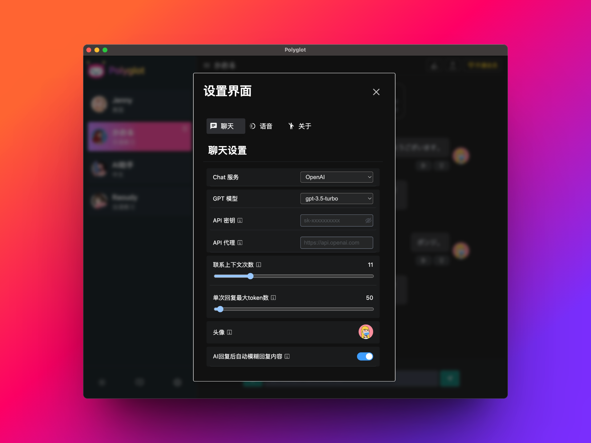
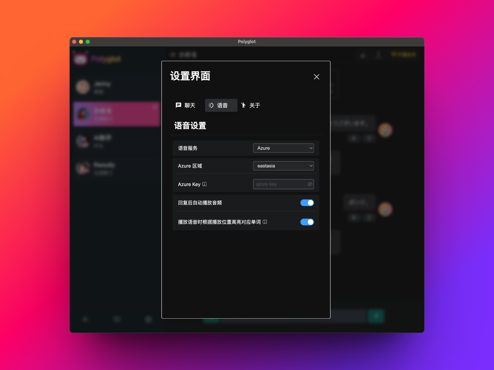
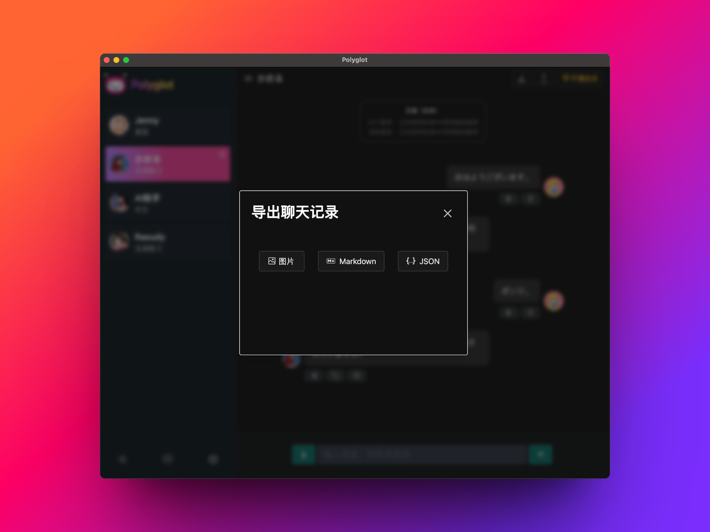

#  Polyglot 
>  AI语言练习应用


<p align="left">
<a href="https://github.com/liou666/polyglot/releases" target="_blank">

</a>
<a href="https://github.com/liou666/polyglot/releases" target="_blank">

</a>
<a href="https://github.com/liou666/polyglot/releases" target="_blank">

</a>
<a href="https://github.com/liou666/polyglot/releases" target="_blank">

</a>
</p>

Polyglot是一款跨平台的桌面端应用程序（目前已支持[web版本](https://polyglotai.xyz)）。基于ChatGPT和Azure人工智能语言模型作为底层服务，旨在提供一个易于使用的语言练习平台，方便进行多语种的口语练习。 ( [📺 B站视频链接](https://www.bilibili.com/video/BV1Ym4y1a7et) )


<p align="center">
  
</p>


## 下载
- **Mac**: [点击下载](https://github.com/liou666/polyglot/releases/download/v0.3.4/Polyglot_0.3.4.dmg)
- **Windows**: [点击下载](https://github.com/liou666/polyglot/releases/download/v0.3.4/Polyglot_0.3.4.exe)
- **Linux**: [点击下载](https://github.com/liou666/polyglot/releases/download/v0.3.4/Polyglot_0.3.4.AppImage)
- **Web版本**： [在线地址](https://polyglotai.xyz)

## 软件截图
<details>
<summary>展开</summary>


<p align="center">
  
</p>

<!-- <p align="center">
  
</p> -->

<p align="center">
  
</p>
<p align="center">
  
</p>
<p align="center">
  
</p>

</details>

## 功能
- [x] 多国语言口语练习 （~~目前内置四个不同国家的AI人物，分别来自美国、日本、韩国和法国。后续将考虑增加更多的语种。~~）（内置了英语，其他语言现在支持自定义）
- [x] 智能语音合成（目前基于Azure TTS服务，后续考虑接入可以本地部署的语音模型）
- [x] 智能对话功能（基于chatGPT服务）
- [x] 支持暗黑模式
- [x] 接入文字翻译功能
- [x] 支持用户自定义语种和AI人物
- [x] 用户自定义配置Azure key
- [x] 自定义头像
- [x] 语音识别支持快捷键操作(按住空格键开始语音识别，放开空格键结束语音识别)
- [x] 支持用户配置自定义对话场景
- [x] 自身语音支持回听
- [ ] 支持Azure openai api、claude api服务（Azure openai api已支持）
- [x] [Web版本](https://polyglotai1.xyz) (目前对手机移动端的适配兼容性不高！)
- [x] 支持AI回复内容模糊处理
- [x] 支持语音播放时根据播放进度高亮对应单词

## 使用方法
+ 设置[OpenAI Key](https://platform.openai.com/account/api-keys)
+ 设置代理（非必须）
+ 设置[azure key](https://portal.azure.com/)
+ 新建AI角色进行对话；
+ 与AI人物进行对话练习口语。

## 本地启动
```bash
# 1.克隆本仓库；
git clone https://github.com/liou666/polyglot.git

# 2.安装依赖；
cd polyglot
pnpm install 
# 安装 electron 失败时尝试使用淘宝镜像源安装👇：
# export ELECTRON_MIRROR=http://npm.taobao.org/mirrors/electron/ && pnpm i

# 3. 根据注释提示配置相关的环境变量
mv .env.example .env

# 4. 启动服务
pnpm dev
```


## 协议
[GNU General Public License v3.0](./LICENSE)

# 贡献者
<div>
  <a href="https://github.com/liou666/polyglot/graphs/contributors">
    
  </a>
</div>

## 常见问题


<details>
<summary>1. MacOS 提示无法打开“Polyglot”，因为Apple无法检查其是否包含恶意软件。</summary>

这个错误因为 macOS 操作系统中的 Gatekeeper 安全功能阻止了应用程序的运行。
要解决此问题，请按照以下步骤操作：

打开“系统偏好设置”并点击“安全性与隐私”。
在“通用”选项卡中，您将看到一个消息：“Polyglot”已被阻止。单击“仍要打开”。
或者，你可以单击“打开任何方式”以打开你的应用程序。
（可能需要使用管理员权限来打开应用程序。）

如果不想在每次打开应用程序时都执行这些步骤，则可以的应用程序添加到白名单中，以便在不受阻止的情况下运行。要将您的应用程序添加到白名单中，请执行以下操作：

打开终端并输入以下命令：

```sh
xattr -rd com.apple.quarantine /path/to/Polyglot.app
```
其中，/path/to/Polyglot.app 是你的应用程序的完整路径。

运行命令后，应用程序将被添加到白名单中，Gatekeeper 将不再阻止其运行。
</details>
<details>
<summary>2. azure语音服务如何申请？</summary>

要申请 Azure 语音服务的 API 密钥，可以按照以下步骤进行：

+ 登录 Azure 门户 （https://portal.azure.com/）
+ 转到“Azure 语音服务”页面并单击“添加”按钮
+ 在“创建 Azure 语音服务”窗口中，选择订阅、资源组、区域，并为新服务指定名称
+ 选择“F0”价格层，并单击“创建”
+ 创建完成后，转到新服务的“概述”页面，即可查看密钥和终结点

</details>

<!-- ## 捐赠
如果觉的项目对你有帮助的话，欢迎请我喝杯奶茶😊。

<table>
  <tr>
    <th>爱发电</th>
    <th>微信</th>
    <th>支付宝</th>
  </tr>
  <tr>
   <td><a target="_blank" href="https://afdian.net/a/liou666">爱发电</a</td>
    <td></td>
    <td></td>
  </tr>
</table>
 -->

## 讨论与交流


<table>
  <tr>
    <td></td>
    <td></td>
  </tr>
</table>

